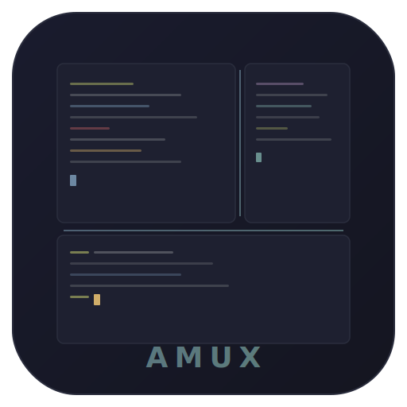

<p align="center">
  
</p>

<h1 align="center">AMUX</h1>

<p align="center">
  <strong>The terminal multiplexer built for Vibe Coding.</strong><br>
  One window. Split panes. AI tools. Everything you need to code with AI, right here.
</p>

<p align="center">
  <a href="#install">Install</a> &middot;
  <a href="#features">Features</a> &middot;
  <a href="#keyboard-shortcuts">Shortcuts</a> &middot;
  <a href="#vibe-coding-tools">Vibe Coding</a> &middot;
  <a href="#building">Building</a>
</p>

---

## Why AMUX?

You're a Vibe Coding developer. You use Claude Code, OpenCode, Codex, or Aider every day. Your workflow looks like this:

1. Open a terminal
2. Start your AI tool
3. Open another terminal to run tests
4. Open another for git
5. Constantly switch between them
6. Lose track of which is which

**AMUX puts everything in one window.** Split panes, tabs, workspaces — organized the way you think. Your AI tool on the left, your build output on the right, your git log at the bottom. One keystroke to split. One keystroke to zoom. One click to launch Claude.

No config files to learn. No prefix keys to memorize. Just right-click and go.

## Features

### Split Panes & Tabs
Split any pane horizontally (`Ctrl+D`) or vertically (`Ctrl+Shift+D`). Drag the divider to resize. Add tabs within panes (`Ctrl+T`). Drag tabs between panes to reorganize.

### Vibe Coding Tool Integration
AMUX auto-detects your installed AI tools and puts them in the right-click menu. One click to launch Claude Code, OpenCode, Codex, Aider, or Gemini CLI in a split pane — with the correct working directory, ready to go.

**WSL-aware**: On Windows, AMUX detects tools in both Windows PATH and WSL. Launch `claude` from WSL without touching a config file.

### Zoom Pane
Working in OpenCode and need more space? Hit `Ctrl+Shift+F` to zoom the active pane fullscreen. Hit it again to restore. The ZOOMED indicator in the tab strip tells you you're in zoom mode.

### Workspace Startup Commands
Configure per-workspace startup scripts at `~/.amux/workspaces/<name>.startup`:

```bash
[pane:1 title=AI]
cd /my/project
claude

[pane:2 title=Build]
cd /my/project
cargo watch -x check

[pane:3 title=Shell]
cd /my/project
```

Switch to a workspace and AMUX auto-creates the panes and runs the commands. Every day starts in one second.

### Workspaces
Organize your projects into workspaces in the sidebar. Double-click to rename. Drag to reorder. Each workspace preserves its own split layout independently.

### Mouse Support for TUI Apps
Full mouse event forwarding — click, drag, scroll all work inside TUI apps (OpenCode, lazygit, htop, vim). AMUX detects mouse mode automatically and switches between terminal selection and TUI forwarding.

### Pixel-Perfect Rendering
Canvas-based terminal rendering with dynamic font metrics. No hardcoded cell widths. Chinese/Japanese/Korean characters render correctly. Underline, italic, and strikethrough text decorations are supported.

### Activity Notifications
Running a long AI task in another pane? A green dot appears on the tab when there's new output. Working in another workspace? The dot appears on the workspace name in the sidebar. You'll never miss when your task finishes.

## Install

### Pre-built Binaries

Download from [GitHub Releases](../../releases):

| Platform | File | Requirements |
|----------|------|-------------|
| Linux x86_64 | `amux-linux-x86_64.tar.gz` | Ubuntu 24.04+, X11/Wayland |
| macOS Apple Silicon | `amux-macos-aarch64.tar.gz` | macOS 13+ |
| Windows x86_64 | `amux-windows-x86_64.zip` | Windows 10 1903+ |

```bash
# Linux
tar xzf amux-linux-x86_64.tar.gz
./amux-linux-x86_64/install.sh

# macOS
tar xzf amux-macos-aarch64.tar.gz
cp -r AMUX.app /Applications/

# Windows — unzip and run amux.exe
```

### From Source

```bash
# Linux
sudo apt install libxcb1-dev libxkbcommon-dev libxkbcommon-x11-dev
cargo build -p amux-desktop --features gpui-linux --release

# macOS / Windows
cargo build -p amux-desktop --features gpui --release
```

## Keyboard Shortcuts

| Shortcut | Action |
|----------|--------|
| `Ctrl+D` | Split right |
| `Ctrl+Shift+D` | Split down |
| `Ctrl+T` | New tab |
| `Ctrl+W` | Close pane |
| `Ctrl+Shift+F` | Zoom / restore pane |
| `Ctrl+Shift+E` | Equalize all splits |
| `Ctrl+M` | Toggle sidebar |
| `Ctrl+Left/Right` | Switch pane |
| `Ctrl+PageUp/Down` | Switch tab |
| `Ctrl+Shift+Left/Right` | Resize split |
| `Ctrl+K` | Clear terminal |
| `Ctrl+Q` | Quit |
| Middle-click | Paste |
| Double-click tab | Rename tab |
| Double-click workspace | Rename workspace |

## Vibe Coding Tools

AMUX auto-detects these tools at startup:

| Tool | Detected Binary |
|------|----------------|
| [Claude Code](https://github.com/anthropics/claude-code) | `claude` |
| [OpenCode](https://github.com/opencode-ai/opencode) | `opencode` |
| [Codex CLI](https://github.com/openai/codex) | `codex` |
| [Aider](https://github.com/paul-gauthier/aider) | `aider` |
| [Gemini CLI](https://github.com/google-gemini/gemini-cli) | `gemini` |
| [GitHub Copilot](https://github.com/github/gh-copilot) | `gh copilot` |

Right-click in any pane to see your installed tools and launch them in a split pane.

## Building

```bash
# Clone
git clone https://github.com/anthropics/amux.git
cd amux

# Quick build (Linux)
./scripts/build.sh --package

# Quick build (Windows PowerShell)
.\scripts\build.ps1 -Package

# Run directly
cargo run -p amux-desktop --features gpui-linux  # Linux
cargo run -p amux-desktop --features gpui         # macOS / Windows
```

## Architecture

```
apps/desktop/          GPUI desktop application
  src/gpui_entry.rs      Main window, input handling, layout
  src/gpui_terminal.rs   Canvas-based terminal renderer

crates/amux-platform/  Terminal backend
  src/terminal/
    alacritty_view.rs    Alacritty terminal emulator wrapper
    manager.rs           Pane/tab/split layout management
```

Built with [GPUI](https://gpui.rs) (from [Zed](https://zed.dev)) and [Alacritty Terminal](https://github.com/alacritty/alacritty).

## License

MIT
